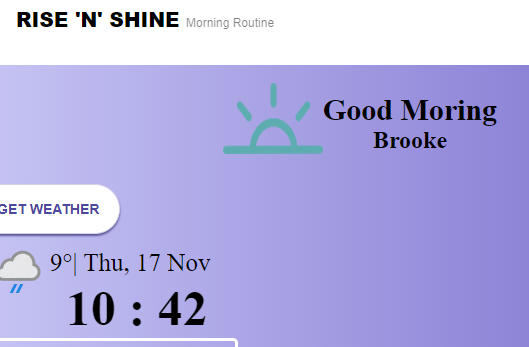

<p align="center">
  <a href="" rel="noopener">
 </a>
</p>

<h3 align="center">Rise 'n' Shine</h3>

<div align="center">

[]()

</div>

---

<p align="center"> This project is a morning routine web app, that allows the user have an account, check the weather in their local area and plan a route for thier day plans.

You can view the live site<a href="https://risenshine-cd3dd.web.app/"> here</a>
    <br> 
</p>

## 📝 Table of Contents

- [About](#about)
- [Getting Started](#getting_started)
- [Deployment](#deployment)
- [Usage](#usage)
- [Built Using](#built_using)
- [ToDo](#toDo)
- [Contributing](../CONTRIBUTING.md)
- [Authors](#authors)
- [Acknowledgments](#acknowledgement)

## 🧐 About <a name = "about"></a>

Using react, I created a web page that is using various APIs. Firebase is used as a Auth to create accounts, as well as a database for affirmations that can CRUD. It uses the TOM TOM api to create a map and allow you to plan a route for the days travels, and the Weather Api using your local location to show the weather happening.  

## 🏁 Getting Started <a name = "getting_started"></a>

To use this project, you will need to clone down this repo. Then use Npm Install to download all dependencies. You will also need API Keys for all APIs being used. 

### Prerequisites

To download all dependencies

```
Npm Install
```

### Api Keys

All these sites will need Api Keys

Weather Api 

```
https://www.weatherapi.com/api-explorer.aspx
```

tom tom API

```
https://developer.tomtom.com/
```

For affirmations, you will need to create a firebase database, with an affirmations collection. 

## ✔️ To Do <a name = "toDo"></a>

- Adding a current news area

- Add alert to tell you how long your journey will take

- Add a to do list

## 🎈 Usage <a name="usage"></a>

The system uses API calls, so that data can be used to show weather, map of local area and affirmations. It also uses your local area's time and date. 

## 🚀 Deployment <a name = "deployment"></a>

To deploy this site, you need to use Firebase. Intialise firebase tools follow the steps. Then in the terminal
```
Npm Build
```
followed by 
```
Firebase Deploy
```

## ⛏️ Built Using <a name = "built_using"></a>

- [React](https://reactjs.org/) - Code Framework
- [JavaScript](https://www.javascript.com/) - Code Language
- [WeatherApi](https://www.weatherapi.com/api-explorer.aspx) - Weather API
- [Tom Tom](https://developer.tomtom.com/) - tom tom API
- [Firebase](https://firebase.google.com/) - Cloud Database, Cloud Auth

## ✍️ Authors <a name = "authors"></a>

- [@BrookeVerse](https://github.com/BrookeVerse) - Idea & Initial work


## 🎉 Acknowledgements <a name = "acknowledgement"></a>

- _nology coaches, that help us develop into Junior Developers

